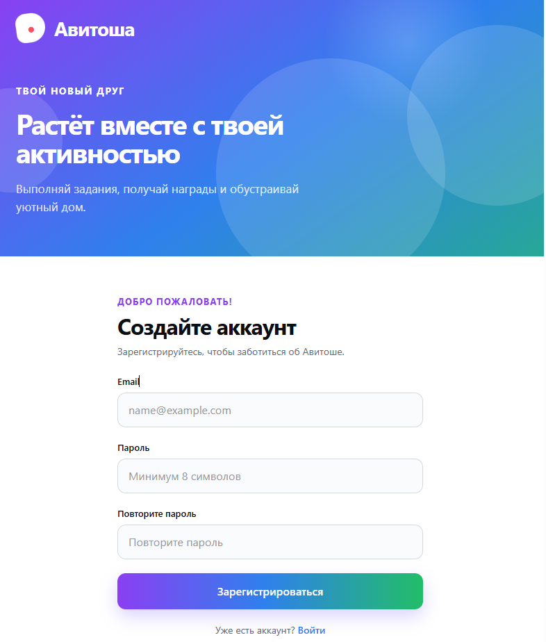
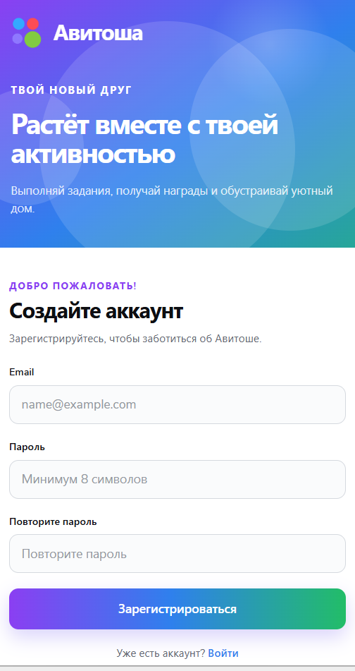

# Авитоша — frontend

Frontend Авитоши — адаптивное React-приложение, которое превращает игровые данные backend в интерактивный кабинет питомца. Пользователь регистрируется или входит в аккаунт, выполняет задания, получает XP и предметы, следит за настроением и характером Авитоши и обустраивает комнату.

## Основной сценарий

```text
Регистрация или вход → восстановление сессии → загрузка игрового кабинета
→ выполнение задания → обновление прогресса и XP → WebSocket-событие
→ новый предмет → размещение в комнате
```

## Интерфейс

### Desktop

Главная страница:


| Регистрация                                                                 | Вход                                                              |
| --------------------------------------------------------------------------- | ----------------------------------------------------------------- |
|  |  |

### Tablet

| Главная страница                                                      | Регистрация                                                          |
| --------------------------------------------------------------------- | -------------------------------------------------------------------- |
|  |  |

### Phone

| Главная страница                                                     | Регистрация                                                         |
| -------------------------------------------------------------------- | ------------------------------------------------------------------- |
|  |  |

## Основной функционал

### Авторизация и сессия

- регистрация с проверкой email, пароля и подтверждения пароля;
- вход в существующий аккаунт;
- access token хранится в Redux только в памяти приложения;
- refresh token передаётся backend через защищённую cookie;
- при старте приложение восстанавливает сессию через refresh и `/api/me`;
- access token автоматически обновляется каждые 14 минут, при возврате на вкладку и восстановлении сети;
- защищённые маршруты недоступны без авторизации;
- авторизованный пользователь автоматически покидает публичные страницы входа и регистрации;
- выход доступен из меню профиля и сопровождается toast-уведомлением;
- при истечении сессии игровое состояние очищается, а пользователь перенаправляется на регистрацию.

### Игровой кабинет

Главная страница собирает восемь независимых серверных ресурсов: питомца, задания, комнату, историю, дневную сводку, лидерборд, достижения и кошелёк наград.

В шапке отображаются:

- текущий уровень и шкала XP;
- настроение Авитоши;
- цель и количество полученных предметов;
- аватар из первой буквы email и меню аккаунта;
- имя питомца с возможностью безопасного переименования;
- текущий баланс Avito-бонусов.

Основная область содержит:

- активную просьбу питомца;
- историю заданий с прогрессом и наградами;
- подробный диалог выбранного задания;
- достижения пользователя;
- комнату, питомца и коллекцию предметов;
- характер Авитоши, дневную статистику и недельный лидерборд;
- кошелёк с каталогом открытых наград и прогрессом до следующей;
- серию посещений, ежедневный квест и превью наград на завтра.

### Задания и игровые действия

Кнопка активного задания формирует типизированное mock-действие Авито с уникальным `eventId` и отправляет его в `POST /api/v1/actions`. После ответа обновляются только затронутые части интерфейса, а пользователь получает toast с результатом: прогрессом, XP, новым уровнем, предметом или достижением.

Повторно полученные события фильтруются по `id`. Redux хранит последние 200 обработанных идентификаторов, поэтому один результат не показывается дважды при одновременном HTTP-ответе и WebSocket-доставке.

### Комната и drag-and-drop

Комната использует реальные PNG-ассеты предметов и поддерживает несколько способов размещения:

- перетаскивание из коллекции в комнату;
- перемещение уже размещённого предмета;
- выбор предмета и клик по свободному месту;
- сдвиг выбранного предмета стрелками клавиатуры;
- сброс к исходной раскладке.

Drag-and-drop реализован через `@dnd-kit/core`. Предмет центрируется под указателем независимо от точки захвата, координаты переводятся в проценты и ограничиваются безопасной областью комнаты. Заблокированные backend предметы нельзя размещать.

Изменённая раскладка хранится локально в Redux и не отправляется на backend. Сервер остаётся источником статусов `LOCKED`, `UNLOCKED` и `PLACED`.

### Персонаж

Авитоша отрисовывается в прозрачном canvas через PixiJS. Компонент:

- загружает кадры анимации через `import.meta.glob`;
- масштабирует текстуру под внутренний canvas;
- воспроизводит процедурную idle-анимацию дыхания и покачивания;
- учитывает `devicePixelRatio`, но ограничивает resolution значением `2`;
- уничтожает Pixi application и освобождает ресурсы при размонтировании;
- адаптирует canvas и размер персонажа под комнату на desktop, tablet и phone.

Структура анимаций допускает добавление новых состояний без изменения компонента комнаты.

### Realtime

После открытия главной страницы frontend подключается к:

```text
/api/v1/ws?access_token=<access_token>
```

WebSocket не заменяет React Query, а сообщает, какие данные устарели:

| Событие                                                          | Обновляемые данные         |
| ---------------------------------------------------------------- | -------------------------- |
| `TASK_PROGRESS_UPDATED`, `TASK_COMPLETED`                        | задания                    |
| `XP_EARNED`, `PET_LEVEL_UP`, `PET_MOOD_CHANGED`                  | питомец                    |
| `ROOM_ITEM_UNLOCKED`                                             | комната                    |
| `STORY_STAGE_COMPLETED`, `STORY_COMPLETED`                       | история и питомец          |
| `LEADERBOARD_SCORE_UPDATED`                                      | лидерборд                  |
| `ACHIEVEMENT_UNLOCKED`                                           | достижения                 |
| `PET_CHARACTER_UNLOCKED`                                         | питомец и характер         |
| `AVITO_REWARD_EARNED`, `REWARD_CATALOG_UNLOCKED`                 | кошелёк наград             |
| `DAILY_QUEST_UPDATED`, `DAILY_QUEST_COMPLETED`, `STREAK_UPDATED` | дневная сводка и retention |

При неожиданном закрытии соединение восстанавливается с exponential backoff от 2 до 30 секунд. После переподключения весь игровой query-cache пользователя инвалидируется. Код закрытия `1008` считается отказом авторизации и не запускает бесконечный reconnect.

## Архитектура frontend

```text
React Router
  ├── public: /register, /login
  ├── protected: /
  └── fallback: *
        ↓
AppProviders
  ├── Redux Provider
  ├── QueryClientProvider
  ├── AuthInitializer
  └── ToastViewport
        ↓
HomePage
  ├── React Query → HTTP /api
  ├── WebSocket → точечная инвалидация query-cache
  └── Redux → auth, UI и синхронизированный game snapshot
```

### Разделение состояния

| Слой              | Ответственность                                                             |
| ----------------- | --------------------------------------------------------------------------- |
| React Query       | запросы, кэш backend-данных, loading/error-состояния, мутации и инвалидация |
| `authSlice`       | access token, пользователь и состояние инициализации сессии                 |
| `gameSlice`       | согласованный snapshot кабинета и дедупликация realtime-событий             |
| `roomEditorSlice` | выбранный предмет, drag-and-drop и локальные координаты                     |
| `toastSlice`      | глобальные уведомления                                                      |
| Локальный state   | состояние конкретного компонента, например открытый диалог задания          |

React Query остаётся источником серверного состояния. Redux snapshot нужен компонентам кабинета, чтобы читать согласованный набор игровых данных без prop drilling.

### Маршрутизация

| Маршрут     | Доступ                             | Страница        |
| ----------- | ---------------------------------- | --------------- |
| `/`         | только авторизованный пользователь | игровой кабинет |
| `/register` | только гость                       | регистрация     |
| `/login`    | только гость                       | вход            |
| `*`         | любой пользователь                 | страница ошибки |

Страницы загружаются лениво через `createBrowserRouter`. Пока refresh-запрос определяет состояние сессии, route guards показывают общий loader и не выполняют преждевременный redirect.

## Стек

| Технология                  | Назначение                                           |
| --------------------------- | ---------------------------------------------------- |
| React 19                    | компонентный UI                                      |
| TypeScript 6                | строгая типизация API, состояния и компонентов       |
| Vite 8                      | dev server, сборка и code splitting                  |
| React Router 7              | маршрутизация, guards и lazy pages                   |
| Redux Toolkit + React Redux | глобальное клиентское состояние                      |
| TanStack React Query 5      | серверное состояние, запросы и мутации               |
| PixiJS 8                    | canvas-отрисовка и анимация питомца                  |
| dnd-kit                     | drag-and-drop предметов комнаты                      |
| React Hook Form + Zod       | формы и типизированная валидация                     |
| SCSS                        | компоненты, переменные, функции и адаптивные миксины |
| Vitest + Testing Library    | unit- и component-тесты                              |
| ESLint + Prettier           | статический анализ и единое форматирование           |

## Работа с API

Общий клиент находится в `src/api/client.ts`. Он:

- добавляет `Accept: application/json`;
- автоматически передаёт cookie через `credentials: include`;
- добавляет `Content-Type` для JSON body;
- преобразует backend error payload в типизированный `ApiError`;
- различает ошибки API, сервера и сети.

Frontend использует следующие endpoints:

| Метод   | Endpoint                  | Назначение                          |
| ------- | ------------------------- | ----------------------------------- |
| `POST`  | `/api/auth/register`      | регистрация                         |
| `POST`  | `/api/auth/login`         | вход                                |
| `POST`  | `/api/auth/refresh`       | обновление access token             |
| `POST`  | `/api/auth/logout`        | завершение сессии                   |
| `GET`   | `/api/me`                 | текущий пользователь                |
| `GET`   | `/api/v1/pet`             | питомец и характер                  |
| `PATCH` | `/api/v1/pet`             | изменение имени питомца             |
| `GET`   | `/api/v1/tasks`           | список заданий                      |
| `GET`   | `/api/v1/tasks/{task_id}` | детали задания                      |
| `POST`  | `/api/v1/actions`         | выполнение игрового действия        |
| `GET`   | `/api/v1/room`            | комната и предметы                  |
| `GET`   | `/api/v1/story`           | сюжетный прогресс                   |
| `GET`   | `/api/v1/daily-summary`   | дневная сводка                      |
| `GET`   | `/api/v1/rewards/wallet`  | баланс, каталог и следующая награда |
| `GET`   | `/api/v1/leaderboard`     | недельный лидерборд                 |
| `GET`   | `/api/v1/achievements`    | достижения                          |
| `GET`   | `/api/v1/ws`              | realtime-события                    |

Ответы со списками нормализуются: `null` заменяется пустым массивом, а неизвестные backend-коды заданий, предметов и достижений не попадают в типизированное состояние.

## Структура

```text
app/frontend
├── helpers
│   ├── _variables.scss        # палитра, типографика, размеры и breakpoints
│   ├── _functions.scss        # rem() и адаптивные миксины
│   └── _index.scss            # единая точка подключения helpers
├── images
│   ├── Avitosha               # кадры анимаций питомца
│   ├── room-items             # предметы комнаты
│   └── screenshots            # изображения для документации
├── src
│   ├── api                    # HTTP-клиент и запросы
│   ├── components             # переиспользуемый UI и его логика
│   ├── hooks                  # auth, game, WebSocket и drag-and-drop hooks
│   ├── pages                  # страницы маршрутов
│   ├── store                  # Redux slices и store
│   ├── styles                 # глобальные стили
│   ├── types                  # API, auth и game types
│   ├── utils                  # presentation и раскладка комнаты
│   ├── App.tsx                # корневой Outlet
│   └── router.ts              # конфигурация маршрутов
├── eslint.config.js
├── vite.config.ts
└── vitest.config.ts
```

## Стили и адаптив

Компоненты используют локальные SCSS-файлы и общие helpers:

```scss
@use '../../../helpers' as h;

.card {
  padding: h.rem(16px);
}

@include h.mobile {
  .card {
    padding: h.rem(12px);
  }
}
```

Доступны breakpoints:

| Миксин           | Максимальная ширина |
| ---------------- | ------------------: |
| `h.laptop`       |            `1440px` |
| `h.laptop-small` |            `1200px` |
| `h.tablet`       |            `1024px` |
| `h.mobile`       |             `768px` |
| `h.mobile-small` |             `480px` |

На небольших экранах шапка сохраняет все игровые показатели, комната меняет пропорции, предметы удерживаются в безопасной области, коллекция перестраивается в сетку, карточки становятся одноколоночными, а диалог задания открывается как нижняя панель.

## Локальный запуск

Сначала запустите backend на `http://127.0.0.1:8080`, затем:

```bash
cd app/frontend
npm ci
npm run dev
```

Vite откроет приложение на <http://localhost:3000> и проксирует HTTP и WebSocket запросы `/api` на backend.

Другой backend можно указать через:

```bash
VITE_API_PROXY_TARGET=http://127.0.0.1:8080 npm run dev
```

Для прямого API URL без dev proxy используется `VITE_API_URL`.

## Команды

| Команда                | Назначение                                   |
| ---------------------- | -------------------------------------------- |
| `npm run dev`          | dev server с HMR                             |
| `npm run build`        | TypeScript project build и production bundle |
| `npm run preview`      | локальный просмотр production build          |
| `npm run typecheck`    | проверка TypeScript                          |
| `npm test`             | запуск Vitest                                |
| `npm run lint`         | проверка ESLint                              |
| `npm run lint:fix`     | автоисправление ESLint                       |
| `npm run format`       | форматирование Prettier                      |
| `npm run format:check` | проверка форматирования                      |

Полная проверка frontend:

```bash
npm run lint
npm run typecheck
npm test
npm run build
npm run format:check
```

## Тестирование

Тесты работают в `jsdom` и покрывают:

- API-клиенты авторизации и игрового слоя;
- Redux auth, game и room editor reducers;
- восстановление сессии и route guards;
- формы регистрации и входа;
- меню профиля и шапку;
- диалог задания;
- drag-and-drop hooks и синхронизацию раскладки.

## Ограничения frontend

- размещение предметов хранится только в Redux и сбрасывается после перезагрузки страницы;
- игровые действия отправляются в демонстрационный публичный endpoint, а не возникают из реального интерфейса Авито;
- WebSocket access token передаётся в URL из-за ограничений browser WebSocket API;
- реализована только idle-анимация питомца, хотя структура допускает новые состояния;
- набор комнат, историй и визуальных ассетов пока фиксирован;
- отдельный offline-режим и service worker не реализованы.

Общая архитектура backend, игровой цикл и полный OpenAPI-контракт описаны в корневом [`README.md`](../../README.md).
