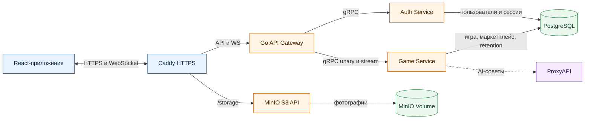
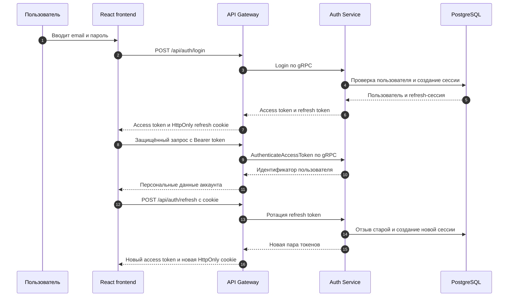
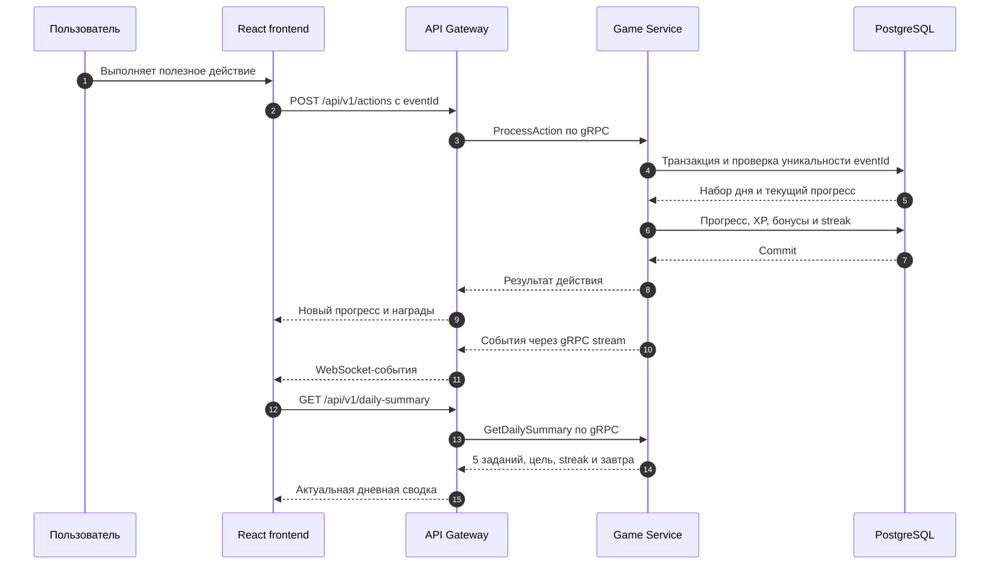
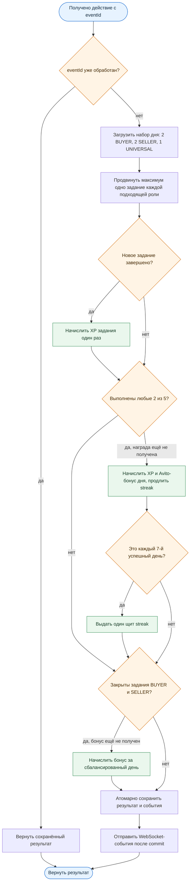
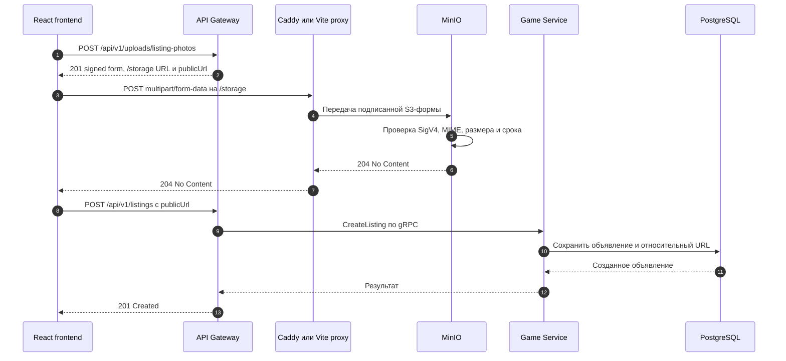
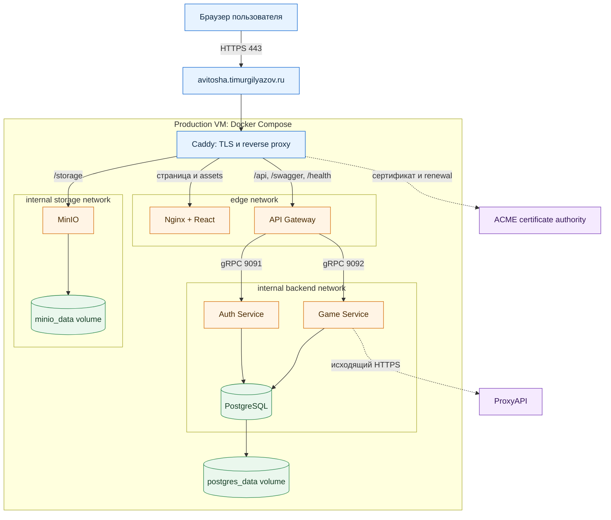

# Диаграммы Авитоши

Набор схем для технической документации и финальной презентации. GitHub отображает блоки Mermaid прямо на странице. Для слайдов диаграмму можно открыть в [Mermaid Live Editor](https://mermaid.live/), экспортировать в SVG и вставить без потери качества.

## Общая архитектура

API Gateway — единственная точка входа в backend. Он не обращается к PostgreSQL напрямую: авторизационные данные принадлежат Auth Service, а игровая логика, объявления, дейлики и награды — Game Service.

## Авторизация и безопасное обновление сессии

Пароль хранится как bcrypt-хеш. Access token короткоживущий, а refresh token хранится в базе только как SHA-256-хеш и ротируется при обновлении сессии.

## Ежедневные задания и награды

### Логика обработки одного действия

Набор закрепляется до следующей полуночи по Москве. После закрытия общей цели пользователь может продолжать выполнять оставшиеся задания и получать их собственный XP.

## Загрузка фотографии объявления в MinIO

Секрет MinIO не попадает во frontend. Backend подписывает короткоживущую форму, браузер загружает файл прямо в Object Storage, а в объявлении сохраняется стабильный относительный адрес `/storage/avitosha-photos/...`.

## Production-деплой

Снаружи опубликованы только порты `80/443`. PostgreSQL, gRPC-сервисы и MinIO работают во внутренних Docker-сетях; данные PostgreSQL и фотографии сохраняются в именованных volumes при пересоздании контейнеров.

## Что показывать на защите

1. Общая архитектура — при объяснении границ сервисов и зоны ответственности backend.
2. Авторизация — во время регистрации, входа и повторного открытия личного кабинета.
3. Дейлики — вместе с демонстрацией набора 2+2+1, цели «любые 2» и streak.
4. MinIO — при создании объявления с фотографией и объяснении безопасной загрузки.
5. Production-деплой — перед открытием приложения по публичной ссылке.
